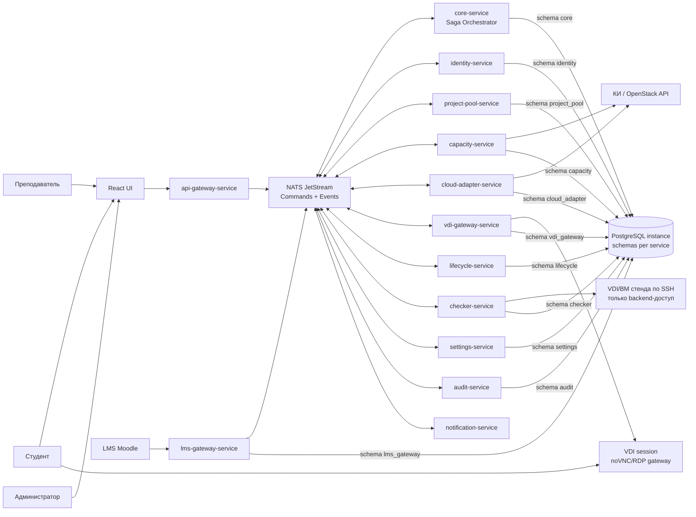
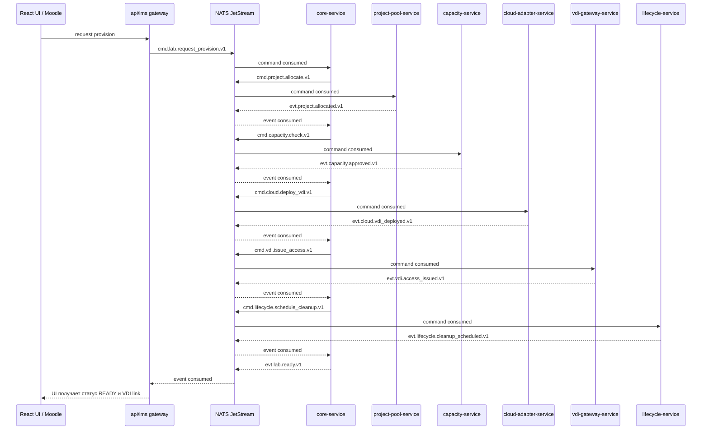
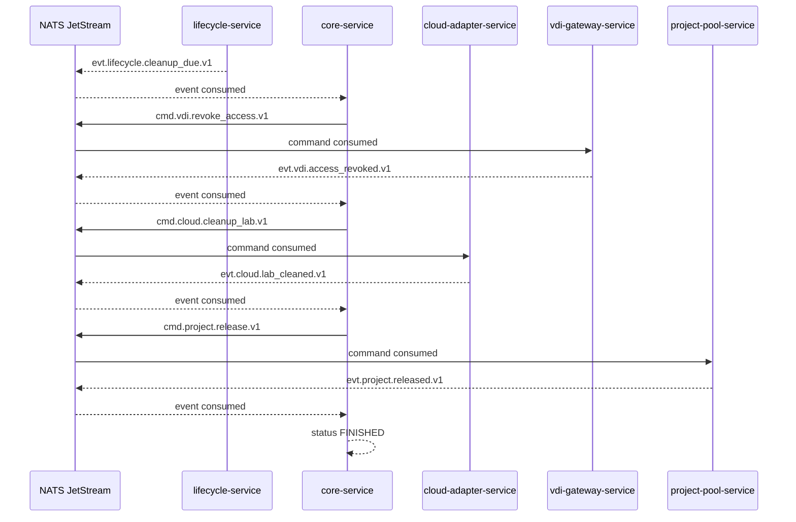
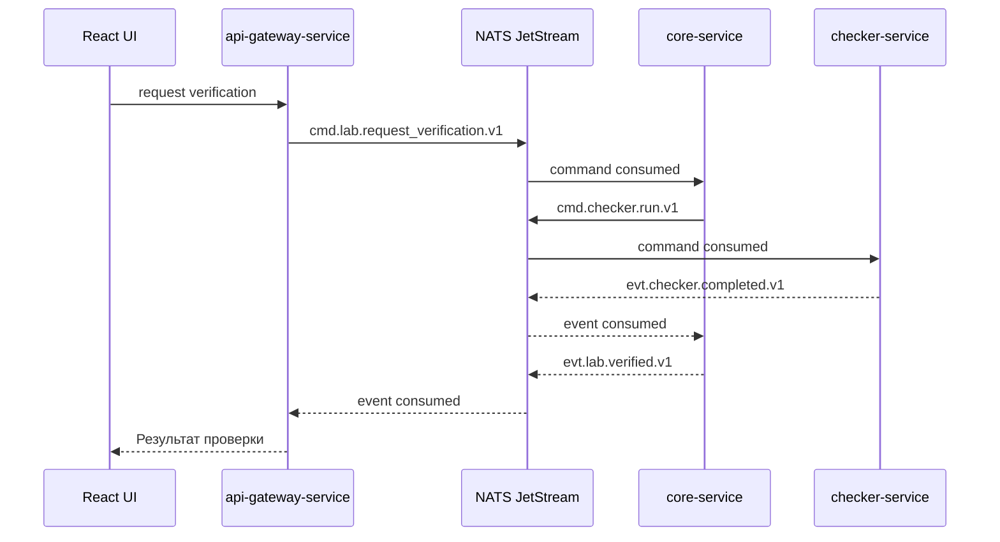

# Cyber Deploy Hub

## 1. Цель системы

Проект - безопасный веб-сервис оркестрации лабораторных стендов в облачной платформе КИ на базе OpenStack API.

Система должна:

- принимать запросы от студентов, преподавателей и LMS Moodle;
- выделять заранее подготовленный изолированный проект КИ из пула;
- проверять, что запуск стенда не поднимет утилизацию кластера выше 90%;
- разворачивать VDI-стенд из шаблонов Glance с нативными SSH-ключами КИ;
- выдавать студенту только VDI-доступ, без доступа к проекту КИ, OpenStack, SSH-ключам и прямым IP-адресам;
- управлять жизненным циклом стенда через NATS JetStream;
- использовать две базовые сущности обмена: `Command` и `Event`;
- автоматически удалять стенд после TTL, по умолчанию через 2 часа;
- замораживать стенд на 24 часа для техподдержки;
- выполнять внутренние безагентные SSH-проверки лабораторных работ силами backend-сервисов;
- хранить полный аудит действий, ошибок и переходов состояния.

## 2. Базовые архитектурные принципы

1. Стек: React, Go, PostgreSQL.
2. Главная часть архитектуры - NATS JetStream.
3. Все изменения состояния запускаются через `Command` в NATS.
4. Все результаты этапов фиксируются через `Event` в NATS.
5. Микросервисы не вызывают друг друга напрямую для бизнес-операций. Они подписываются на свои commands/events и публикуют новые events/commands.
6. Архитектура: event driven + saga orchestration.
7. Если этап завершился ошибкой, saga останавливается, состояние задачи становится `FAILED`, пользователю возвращается понятная ошибка.
8. В каждом сервисе, который меняет состояние, используются `outbox` и `inbox`.
9. Основная saga оркестрируется `core-service`.
10. Сервисы разделены по бизнес-возможностям, а не по техническим слоям.
11. Динамическое создание доменов и проектов КИ запрещено. Используется только заранее подготовленный пул проектов.
12. Студент получает только VDI-доступ к своему стенду. Ему не выдаются OpenStack credentials, SSH-ключи, прямые IP и доступ к проекту КИ.
13. Статические пароли запрещены. Внутренний доступ сервисов к VDI/ВМ только через нативные SSH-ключи КИ.
14. В проекте используется один PostgreSQL instance. Каждый микросервис работает только со своей PostgreSQL schema и не читает чужие схемы напрямую.

## 3. Общая схема



Ключевая идея схемы: NATS - не вспомогательная очередь, а центр бизнес-взаимодействия. Любая команда на изменение состояния проходит через `cmd.*`, любой завершенный факт фиксируется через `evt.*`. HTTP API и Moodle gateway только превращают внешний запрос в command и показывают read model пользователю.

## 4. Микросервисы

### 4.1. `api-gateway-service`

Назначение: единая HTTP-точка входа для React UI и внешних клиентов.

Ответственность:

- REST API для UI;
- WebSocket или SSE для обновления статусов стенда;
- проверка access token;
- RBAC на уровне маршрутов;
- нормализация ошибок для фронтенда;
- преобразование HTTP-запросов в NATS commands;
- подписка на NATS events для live-обновлений UI;
- чтение read model статусов стендов;
- отсутствие тяжелой бизнес-логики.

Пример API:

- `POST /api/labs` - запросить запуск лабораторного стенда;
- `GET /api/labs/{labRunID}` - получить состояние стенда;
- `GET /api/labs/{labRunID}/vdi` - получить одноразовую ссылку или токен VDI-сессии;
- `POST /api/labs/{labRunID}/freeze` - включить режим техподдержки;
- `POST /api/labs/{labRunID}/check` - запустить внутреннюю SSH-проверку;
- `POST /api/labs/{labRunID}/cleanup` - принудительно очистить стенд;
- `GET /api/admin/audit` - журнал действий;
- `GET /api/admin/settings` - текущие настройки TTL и лимитов;
- `PATCH /api/admin/settings` - изменить настройки.

NATS:

- публикует `cmd.lab.request_provision.v1`;
- публикует `cmd.lab.request_freeze.v1`;
- публикует `cmd.lab.request_verification.v1`;
- публикует `cmd.lab.request_cleanup.v1`;
- публикует `cmd.lab.request_vdi_access.v1`;
- читает `evt.lab.*`, `evt.vdi.*`, `evt.checker.*` для обновления UI.

Хранилище: отдельная БД не обязательна. Можно хранить только rate limit/session metadata, если потребуется.

### 4.2. `identity-service`

Назначение: пользователи, роли, авторизация и связь локальных аккаунтов с Moodle.

Ответственность:

- роли `student`, `teacher`, `admin`, `system`;
- локальные пользователи для ручного входа;
- внешние идентификаторы Moodle/LTI;
- выпуск и проверка JWT или opaque session token;
- маппинг преподавателей на курсы;
- аудит входов и подозрительных действий.

Основные таблицы:

- `users`;
- `roles`;
- `user_roles`;
- `external_identities`;
- `sessions`;
- `outbox`;
- `inbox`.

### 4.3. `core-service`

Назначение: центральный оркестратор saga и машина состояний лабораторного стенда.

Это ключевой сервис проекта. Он не должен ходить напрямую в КИ, Moodle, VDI gateway или по SSH. Его задача - принимать commands из NATS, хранить состояние бизнес-процесса и публиковать следующие commands/events через NATS.

Ответственность:

- создание `lab_run`;
- хранение текущего состояния лабораторного стенда;
- запуск saga `LabProvisioningSaga`;
- запуск saga `LabCleanupSaga`;
- запуск saga `LabVerificationSaga`;
- обработка успешных и ошибочных событий от сервисов;
- компенсации: release project, cleanup VDI/VM, revoke VDI access, cancel timers;
- остановка saga при ошибках;
- подготовка статуса для UI;
- публикация доменных событий в NATS.

Основные состояния `lab_run`:

- `REQUESTED` - запрос принят;
- `ALLOCATING_PROJECT` - идет выделение проекта из пула;
- `CHECKING_CAPACITY` - идет проверка лимитов кластера;
- `DEPLOYING` - идет создание ключей и VDI-стенда;
- `ISSUING_VDI_ACCESS` - идет выпуск защищенной VDI-сессии;
- `READY` - VDI-стенд готов;
- `VERIFYING` - идет автоматическая проверка;
- `VERIFIED` - проверка успешно завершена;
- `VERIFICATION_FAILED` - проверка выполнена, но критерии не пройдены;
- `FROZEN` - стенд заморожен для техподдержки;
- `CLEANING` - идет очистка;
- `FINISHED` - стенд очищен, проект возвращен в пул;
- `FAILED` - saga остановлена из-за ошибки.

Основные таблицы:

- `lab_runs`;
- `lab_run_events`;
- `saga_instances`;
- `saga_steps`;
- `outbox`;
- `inbox`.

### 4.4. `project-pool-service`

Назначение: управление заранее подготовленным пулом проектов КИ.

Ответственность:

- импорт списка доменов и проектов КИ;
- хранение состояния проектов: `FREE`, `RESERVED`, `IN_USE`, `CLEANING`, `QUARANTINED`;
- атомарное выделение свободного проекта студенту;
- возврат проекта в пул после очистки;
- блокировка проекта при сбоях очистки;
- запрет выделения одного проекта двум студентам;
- поддержка политики "один студент - один индивидуальный проект".

Важная реализация:

- выделение проекта через транзакцию PostgreSQL;
- `SELECT ... FOR UPDATE SKIP LOCKED` для конкурентной нагрузки;
- уникальные ограничения по активной привязке `student_id + course_id`;
- идемпотентность по `saga_id` и `idempotency_key`.

Основные таблицы:

- `ki_domains`;
- `ki_projects`;
- `project_allocations`;
- `project_state_history`;
- `outbox`;
- `inbox`.

### 4.5. `capacity-service`

Назначение: предиктивный контроль емкости КИ.

Ответственность:

- периодический сбор утилизации CPU, RAM, Storage из КИ/OpenStack;
- расчет текущей загрузки кластера;
- расчет прогнозной загрузки после запуска стенда;
- блокировка запуска, если прогноз выше 90%;
- фиксация отказа в логах администратора;
- публикация событий о capacity decision.

Формула решения:

```text
predicted_usage = current_usage + requested_lab_resources

if predicted_cpu > 90% or predicted_ram > 90% or predicted_storage > 90%:
    decision = DENIED
else:
    decision = APPROVED
```

Основные таблицы:

- `resource_snapshots`;
- `capacity_decisions`;
- `resource_reservations`;
- `outbox`;
- `inbox`.

### 4.6. `cloud-adapter-service`

Назначение: единственный сервис, который работает с КИ/OpenStack API.

Ответственность:

- создание нативной SSH key pair в КИ;
- создание VDI-стенда из Glance image;
- назначение flavor;
- работа с Neutron network/router/security groups в рамках уже подготовленного проекта;
- получение внутренних IP-адресов VDI/ВМ для backend-сервисов;
- удаление VDI/ВМ, key pair и временных ресурсов;
- очистка проекта перед возвратом в пул;
- ретраи на сетевые ошибки OpenStack API;
- сохранение технических идентификаторов ресурсов.

Запрещено:

- создавать домены;
- создавать новые проекты;
- хранить статические пароли;
- раскрывать private key в логах;
- отдавать студенту прямой IP, SSH-доступ или credentials проекта КИ.

Секреты:

- private key хранится зашифрованным;
- доступ к private key ограничен сервисами `cloud-adapter-service` и `checker-service`;
- в идеале ключ хранится через KMS/Vault, для MVP допустимо шифрование envelope key из env secret.

Основные таблицы:

- `provision_jobs`;
- `vdi_instances`;
- `ssh_key_pairs`;
- `cloud_resource_history`;
- `outbox`;
- `inbox`.

NATS:

- потребляет `cmd.cloud.deploy_vdi.v1`;
- потребляет `cmd.cloud.cleanup_lab.v1`;
- публикует `evt.cloud.vdi_deployed.v1`;
- публикует `evt.cloud.deploy_failed.v1`;
- публикует `evt.cloud.lab_cleaned.v1`;
- публикует `evt.cloud.cleanup_failed.v1`.

### 4.7. `vdi-gateway-service`

Назначение: единственная точка пользовательского доступа к лабораторному стенду.

Студент не получает доступ к OpenStack, проекту КИ, SSH, private key или прямому IP. После успешного деплоя он получает только VDI-сессию: например, browser-based noVNC/Guacamole/RDP gateway с короткоживущим токеном.

Ответственность:

- выпуск одноразового или короткоживущего VDI access token;
- привязка VDI-сессии к `student_id`, `lab_run_id` и роли пользователя;
- проверка, что пользователь имеет право открыть именно свой стенд;
- проксирование VDI-трафика без раскрытия IP стенда;
- отзыв доступа при cleanup, freeze policy или инциденте;
- аудит открытия и закрытия VDI-сессий;
- rate limiting и ограничение параллельных сессий.

Основные таблицы:

- `vdi_sessions`;
- `vdi_access_tokens`;
- `vdi_session_events`;
- `outbox`;
- `inbox`.

NATS:

- потребляет `cmd.vdi.issue_access.v1`;
- потребляет `cmd.vdi.revoke_access.v1`;
- потребляет `evt.cloud.vdi_deployed.v1`;
- потребляет `evt.lifecycle.cleanup_due.v1`;
- публикует `evt.vdi.access_issued.v1`;
- публикует `evt.vdi.access_revoked.v1`;
- публикует `evt.vdi.access_failed.v1`.

### 4.8. `lifecycle-service`

Назначение: планировщик жизненного цикла стендов.

Ответственность:

- создание таймера автоматической очистки;
- TTL стенда по умолчанию - 2 часа;
- freeze TTL по умолчанию - 24 часа;
- отмена или перенос таймера при freeze;
- публикация события об истечении TTL;
- корректная работа после рестарта сервиса.

Реализация:

- таймеры хранятся в PostgreSQL;
- сервис периодически выбирает due timers через `FOR UPDATE SKIP LOCKED`;
- событие `lab.cleanup_due.v1` публикуется через outbox;
- для новых стендов используются актуальные настройки из `settings-service`.

Основные таблицы:

- `lab_timers`;
- `timer_history`;
- `outbox`;
- `inbox`.

### 4.9. `checker-service`

Назначение: внутренняя безагентная SSH-проверка лабораторных работ.

Ответственность:

- подключение к VDI/ВМ стенда по SSH только backend-сервисом;
- выполнение проверок через Ansible или структурированные сценарии;
- проверка установленного ПО;
- проверка конфигурационных файлов;
- проверка открытых портов;
- сбор детального лога ошибок;
- возврат результата в `core-service`;
- сохранение артефактов проверки.

Типы проверок:

- `package_installed`;
- `file_exists`;
- `file_contains`;
- `service_active`;
- `port_open`;
- `command_exit_code`;
- `custom_script`.

Основные таблицы:

- `check_profiles`;
- `check_profile_steps`;
- `check_runs`;
- `check_step_results`;
- `outbox`;
- `inbox`.

NATS:

- потребляет `cmd.checker.run.v1`;
- потребляет `evt.cloud.vdi_deployed.v1` для обновления внутренних endpoint metadata;
- публикует `evt.checker.completed.v1`;
- публикует `evt.checker.failed.v1`.

### 4.10. `lms-gateway-service`

Назначение: интеграция с LMS Moodle.

Ответственность:

- прием launch-запросов из Moodle;
- LTI 1.3 как приоритетное решение;
- REST/Web Services API или эмулятор Moodle как MVP-альтернатива;
- валидация подписи/токена запроса;
- маппинг Moodle user/course/lab на локальные сущности;
- отправка результата проверки обратно в Moodle, если интеграция это поддерживает.

Основные таблицы:

- `lms_platforms`;
- `lms_courses`;
- `lms_users`;
- `lms_lab_mappings`;
- `lti_nonces`;
- `outbox`;
- `inbox`.

### 4.11. `settings-service`

Назначение: runtime-настройки для преподавателей и администраторов.

Ответственность:

- хранение TTL лабораторной работы;
- хранение TTL freeze-режима;
- хранение порога capacity, по умолчанию 90%;
- настройки retry policy;
- настройки доступных шаблонов лабораторных работ;
- публикация события об изменении настроек.

Ключевые настройки:

- `lab.default_ttl_minutes = 120`;
- `lab.freeze_ttl_minutes = 1440`;
- `capacity.max_cluster_usage_percent = 90`;
- `cleanup.retry_max_attempts`;
- `checker.ssh_timeout_seconds`.

Основные таблицы:

- `settings`;
- `settings_history`;
- `outbox`;
- `inbox`.

### 4.12. `audit-service`

Назначение: централизованный аудит.

Ответственность:

- запись действий пользователей;
- запись событий saga;
- запись отказов capacity;
- запись ошибок OpenStack API;
- запись операций очистки и freeze;
- API для панели преподавателя/администратора.

Особенности:

- audit log append-only;
- события не удаляются обычными операциями;
- для MVP достаточно PostgreSQL;
- для высокой нагрузки можно позже добавить ClickHouse/OpenSearch, но не как обязательную зависимость MVP.

Основные таблицы:

- `audit_events`;
- `admin_notes`;
- `outbox`;
- `inbox`.

### 4.13. `notification-service`

Назначение: уведомления пользователям и UI.

Ответственность:

- публикация live-обновлений для gateway;
- email/telegram/webhook уведомления, если нужны;
- уведомления преподавателю о freeze-заявке;
- уведомления студенту о готовности стенда или ошибке.

Для MVP этот сервис можно упростить: оставить только события для WebSocket/SSE через `api-gateway-service`.

## 5. Frontend

Frontend: React.

Основные экраны:

- экран студента со статусом лабораторного стенда;
- запуск лабораторной работы;
- открытие VDI-сессии после готовности стенда;
- кнопка "Запросить техподдержку";
- запуск проверки;
- просмотр результата проверки;
- панель преподавателя со списком стендов;
- панель изменения TTL и freeze TTL;
- просмотр audit log;
- панель проектов пула;
- экран ошибок capacity и OpenStack.

Статусы UI должны отображать реальные состояния `lab_run`, а не локальные догадки фронтенда.

Пользовательский доступ:

- студент видит кнопку "Открыть VDI";
- студент не видит IP стенда, SSH-ключи, OpenStack project ID и cloud credentials;
- VDI-ссылка короткоживущая: UI запрашивает ее через `cmd.lab.request_vdi_access.v1`, а `core-service` выпускает доступ через `cmd.vdi.issue_access.v1`;
- при очистке стенда VDI-доступ отзывается через `cmd.vdi.revoke_access.v1`.

## 6. NATS JetStream

NATS JetStream - центральная шина архитектуры. Все микросервисы используют две сущности:

- `Command` - намерение выполнить действие. У command есть один логический владелец-исполнитель.
- `Event` - факт, который уже произошел. У event может быть много подписчиков.

Мутации состояния запрещено выполнять через прямые синхронные вызовы между сервисами. Для изменения состояния сервис публикует command или event в NATS, а получатель обрабатывает сообщение через inbox/outbox.

### 6.1. Сущность `Command`

`Command` отвечает на вопрос "что нужно сделать".

Примеры:

- выделить проект;
- проверить capacity;
- развернуть VDI;
- выпустить VDI-доступ;
- запланировать cleanup;
- запустить проверку;
- очистить стенд.

Требования:

- command адресуется конкретному bounded context через subject `cmd.<context>.<action>.v1`;
- command должен быть идемпотентным по `idempotency_key`;
- command не считается фактом, пока сервис-исполнитель не опубликовал event;
- command хранится в outbox отправителя и inbox получателя.

Пример:

```json
{
  "message_id": "uuid",
  "message_kind": "COMMAND",
  "message_type": "cmd.cloud.deploy_vdi.v1",
  "schema_version": 1,
  "occurred_at": "2026-05-20T20:30:00Z",
  "producer": "core-service",
  "correlation_id": "uuid",
  "causation_id": "uuid",
  "saga_id": "uuid",
  "aggregate_type": "lab_run",
  "aggregate_id": "uuid",
  "idempotency_key": "uuid",
  "payload": {
    "lab_run_id": "uuid",
    "project_id": "uuid",
    "image_id": "glance-image-id",
    "flavor_id": "openstack-flavor-id"
  }
}
```

### 6.2. Сущность `Event`

`Event` отвечает на вопрос "что уже произошло".

Примеры:

- проект выделен;
- capacity одобрена;
- VDI развернут;
- VDI-доступ выпущен;
- cleanup запланирован;
- проверка завершена;
- стенд очищен;
- saga завершилась ошибкой.

Требования:

- event публикуется как неизменяемый факт через subject `evt.<context>.<fact>.v1`;
- event не должен требовать ответа от конкретного сервиса;
- несколько сервисов могут реагировать на один event независимо;
- event хранится в outbox производителя и inbox каждого потребителя.

Пример:

```json
{
  "message_id": "uuid",
  "message_kind": "EVENT",
  "message_type": "evt.cloud.vdi_deployed.v1",
  "schema_version": 1,
  "occurred_at": "2026-05-20T20:33:00Z",
  "producer": "cloud-adapter-service",
  "correlation_id": "uuid",
  "causation_id": "uuid",
  "saga_id": "uuid",
  "aggregate_type": "lab_run",
  "aggregate_id": "uuid",
  "idempotency_key": "uuid",
  "payload": {
    "lab_run_id": "uuid",
    "project_id": "uuid",
    "instance_id": "openstack-server-id",
    "internal_ip": "10.10.1.42"
  },
  "error": null
}
```

### 6.3. Потоки

Рекомендуемые streams:

- `COMMANDS` - все commands, subjects `cmd.>`;
- `EVENTS` - все events, subjects `evt.>`;
- `DLQ` - dead letter commands/events, subjects `dlq.>`;
- опционально для production: отдельные streams `LAB_EVENTS`, `CLOUD_EVENTS`, `VDI_EVENTS`, `CHECKER_EVENTS`, если нужно разнести retention и лимиты.

### 6.4. Общее соглашение об envelope

Каждое сообщение NATS должно иметь общий envelope. Для commands и events поля одинаковые, отличается только `message_kind` и `message_type`.

```json
{
  "message_id": "uuid",
  "message_kind": "COMMAND|EVENT",
  "message_type": "cmd.lab.request_provision.v1",
  "schema_version": 1,
  "occurred_at": "2026-05-20T20:30:00Z",
  "producer": "api-gateway-service",
  "correlation_id": "uuid",
  "causation_id": "uuid",
  "saga_id": "uuid",
  "aggregate_type": "lab_run",
  "aggregate_id": "uuid",
  "idempotency_key": "uuid",
  "payload": {},
  "error": null
}
```

Контракты сообщений нужно хранить отдельно от реализации сервисов:

```text
contracts/
  nats/
    commands/
      cmd.cloud.deploy_vdi.v1.schema.json
      cmd.vdi.issue_access.v1.schema.json
    events/
      evt.cloud.vdi_deployed.v1.schema.json
      evt.vdi.access_issued.v1.schema.json
```

Сервисы могут генерировать Go-типы из этих схем или держать локальные DTO, но schema version и payload должны совпадать с контрактом.

### 6.5. Основные commands и events

Команды:

- `cmd.identity.upsert_external_user.v1`;
- `cmd.identity.validate_access.v1`;
- `cmd.lab.request_provision.v1`;
- `cmd.lab.request_freeze.v1`;
- `cmd.lab.request_verification.v1`;
- `cmd.lab.request_cleanup.v1`;
- `cmd.lab.request_vdi_access.v1`;
- `cmd.project.allocate.v1`;
- `cmd.project.release.v1`;
- `cmd.capacity.check.v1`;
- `cmd.capacity.release_reservation.v1`;
- `cmd.cloud.deploy_vdi.v1`;
- `cmd.cloud.cleanup_lab.v1`;
- `cmd.vdi.issue_access.v1`;
- `cmd.vdi.revoke_access.v1`;
- `cmd.lifecycle.schedule_cleanup.v1`;
- `cmd.lifecycle.freeze_lab.v1`;
- `cmd.lifecycle.cancel_timer.v1`;
- `cmd.checker.run.v1`;
- `cmd.settings.update.v1`;
- `cmd.notification.send.v1`;
- `cmd.audit.write.v1`.

События:

- `evt.identity.user_mapped.v1`;
- `evt.identity.access_validated.v1`;
- `evt.identity.access_denied.v1`;
- `evt.lab.requested.v1`;
- `evt.project.allocated.v1`;
- `evt.project.allocation_failed.v1`;
- `evt.capacity.approved.v1`;
- `evt.capacity.denied.v1`;
- `evt.cloud.vdi_deployed.v1`;
- `evt.cloud.deploy_failed.v1`;
- `evt.vdi.access_issued.v1`;
- `evt.vdi.access_revoked.v1`;
- `evt.vdi.access_failed.v1`;
- `evt.lifecycle.cleanup_scheduled.v1`;
- `evt.lifecycle.cleanup_due.v1`;
- `evt.lifecycle.lab_frozen.v1`;
- `evt.checker.completed.v1`;
- `evt.checker.failed.v1`;
- `evt.cloud.lab_cleaned.v1`;
- `evt.project.released.v1`;
- `evt.lab.ready.v1`;
- `evt.lab.verified.v1`;
- `evt.lab.failed.v1`;
- `evt.lab.finished.v1`;
- `evt.settings.changed.v1`;
- `evt.notification.sent.v1`;
- `evt.notification.failed.v1`.

### 6.6. Матрица реакций микросервисов

| Сервис | Потребляет | Публикует |
| --- | --- | --- |
| `identity-service` | `cmd.identity.upsert_external_user.v1`, `cmd.identity.validate_access.v1` | `evt.identity.user_mapped.v1`, `evt.identity.access_validated.v1`, `evt.identity.access_denied.v1` |
| `api-gateway-service` | `evt.lab.*`, `evt.vdi.*`, `evt.checker.*` | `cmd.lab.request_*` |
| `lms-gateway-service` | `evt.lab.ready.v1`, `evt.checker.completed.v1`, `evt.lab.failed.v1` | `cmd.lab.request_provision.v1`, `cmd.lab.request_verification.v1` |
| `core-service` | `cmd.lab.request_*`, `evt.project.*`, `evt.capacity.*`, `evt.cloud.*`, `evt.vdi.*`, `evt.lifecycle.*`, `evt.checker.*` | `cmd.project.*`, `cmd.capacity.*`, `cmd.cloud.*`, `cmd.vdi.*`, `cmd.lifecycle.*`, `cmd.checker.run.v1`, `evt.lab.*` |
| `project-pool-service` | `cmd.project.allocate.v1`, `cmd.project.release.v1` | `evt.project.allocated.v1`, `evt.project.allocation_failed.v1`, `evt.project.released.v1` |
| `capacity-service` | `cmd.capacity.check.v1`, `cmd.capacity.release_reservation.v1` | `evt.capacity.approved.v1`, `evt.capacity.denied.v1`, `evt.capacity.reservation_released.v1` |
| `cloud-adapter-service` | `cmd.cloud.deploy_vdi.v1`, `cmd.cloud.cleanup_lab.v1` | `evt.cloud.vdi_deployed.v1`, `evt.cloud.deploy_failed.v1`, `evt.cloud.lab_cleaned.v1`, `evt.cloud.cleanup_failed.v1` |
| `vdi-gateway-service` | `cmd.vdi.issue_access.v1`, `cmd.vdi.revoke_access.v1`, `evt.cloud.vdi_deployed.v1`, `evt.lifecycle.cleanup_due.v1` | `evt.vdi.access_issued.v1`, `evt.vdi.access_revoked.v1`, `evt.vdi.access_failed.v1` |
| `lifecycle-service` | `cmd.lifecycle.schedule_cleanup.v1`, `cmd.lifecycle.freeze_lab.v1`, `cmd.lifecycle.cancel_timer.v1`, `evt.settings.changed.v1` | `evt.lifecycle.cleanup_scheduled.v1`, `evt.lifecycle.cleanup_due.v1`, `evt.lifecycle.lab_frozen.v1` |
| `checker-service` | `cmd.checker.run.v1`, `evt.cloud.vdi_deployed.v1` | `evt.checker.completed.v1`, `evt.checker.failed.v1` |
| `settings-service` | `cmd.settings.update.v1` | `evt.settings.changed.v1` |
| `audit-service` | `evt.*`, `cmd.audit.write.v1` | audit read model updates |
| `notification-service` | `cmd.notification.send.v1`, `evt.lab.*`, `evt.vdi.*`, `evt.checker.*`, `evt.lifecycle.*` | `evt.notification.sent.v1`, `evt.notification.failed.v1` |

## 7. Outbox и inbox

### 7.1. Outbox

Правило: если сервис меняет свое состояние и должен опубликовать command или event, запись состояния и запись в `outbox` выполняются в одной транзакции PostgreSQL.

Пример:

```text
BEGIN;
  UPDATE lab_runs SET status = 'ALLOCATING_PROJECT' WHERE id = $1;
  INSERT INTO outbox(message_id, message_kind, subject, payload, status) VALUES (...);
COMMIT;
```

Отдельный publisher читает `outbox`, публикует command/event в NATS JetStream и помечает запись как `PUBLISHED`.

### 7.2. Inbox

Правило: каждый входящий command/event сначала регистрируется в `inbox` с уникальным `message_id`.

Если событие уже обработано, сервис не выполняет бизнес-логику повторно.

Пример:

```text
BEGIN;
  INSERT INTO inbox(message_id, message_kind, subject, received_at)
  VALUES (...)
  ON CONFLICT DO NOTHING;

  -- если вставки не было, событие уже обработано
  -- если вставка была, выполняем бизнес-логику
COMMIT;
```

NATS ack отправляется только после успешного commit.

## 8. Saga

### 8.1. Saga запуска лабораторного стенда



При ошибке:

- `project-pool-service` не нашел свободный проект: `FAILED`, пользователю ошибка "Нет свободных проектов";
- `capacity-service` вернул отказ: core публикует `cmd.project.release.v1`, затем `FAILED`;
- `cloud-adapter-service` не смог развернуть VDI: core запускает cleanup/release compensation, затем `FAILED`;
- `vdi-gateway-service` не смог выпустить VDI-доступ: core отзывает доступ, запускает cleanup/release compensation и переводит saga в `FAILED`;
- `lifecycle-service` не смог поставить таймер: core не должен выдавать стенд как `READY`, пока таймер не создан.

### 8.2. Saga очистки стенда



Если очистка неуспешна, проект переводится в `QUARANTINED`, стенд получает состояние `FAILED` или `CLEANUP_FAILED`, а администратор видит инцидент в audit log.

### 8.3. Saga проверки лабораторной работы



Результат проверки не должен автоматически удалять стенд. Если студент провалил проверку, стенд остается доступен до TTL или freeze.

## 9. PostgreSQL модель по сервисам

В проекте используется один PostgreSQL instance в `docker-compose`. Разделение сервисов делается через отдельные schemas внутри этого instance.

Правило: сервис может писать и читать только свою schema. Обмен данными между сервисами идет через NATS commands/events, а не через прямые SQL-запросы к чужим таблицам.

Пример схем:

- `core`;
- `identity`;
- `project_pool`;
- `capacity`;
- `cloud_adapter`;
- `vdi_gateway`;
- `lifecycle`;
- `checker`;
- `lms_gateway`;
- `settings`;
- `audit`.

Внутри каждой schema у stateful-сервиса должны быть свои таблицы `outbox` и `inbox`.

## 10. Безопасность

Ключевые правила:

- не хранить секреты в коде;
- не коммитить `.env`;
- OpenStack credentials только через env/Vault;
- private SSH key не логировать;
- private SSH key хранить зашифрованно;
- студенту выдавать только VDI-сессию, без прямого IP, SSH и OpenStack credentials;
- VDI access token должен быть короткоживущим и отзывным;
- контейнеры запускать от non-root пользователя;
- все внешние запросы валидировать;
- Moodle/LTI запросы проверять по подписи или токену;
- audit log вести для всех критичных действий.

Минимальные инструменты DevSecOps:

- `golangci-lint`;
- `gosec`;
- `govulncheck`;
- `npm audit`;
- `eslint`;
- `gitleaks`;
- `trivy` для контейнеров.

## 11. Высокая нагрузка и надежность

Решения:

- NATS JetStream с durable consumers;
- explicit ack только после успешного commit;
- retry policy с backoff;
- DLQ для событий, которые не удалось обработать;
- идемпотентные handlers;
- отдельные contracts для `Command` и `Event`;
- `outbox` и `inbox` в каждом stateful-сервисе;
- PostgreSQL connection pooling;
- конкурентное выделение проектов через `FOR UPDATE SKIP LOCKED`;
- лимиты на параллельные deploy/cleanup операции;
- rate limiting на API Gateway;
- health checks и readiness checks;
- structured logging с `correlation_id` и `saga_id`;
- metrics: latency, error rate, queue lag, active labs, free projects, capacity usage.

## 12. Go project layout

Рекомендуемая структура для каждого backend-сервиса:

```text
services/<service-name>/
  cmd/<service-name>/main.go
  internal/
    app/
    config/
    contracts/
      commands/
      events/
    domain/
    usecase/
    repository/
    transport/
      http/
      nats/
    outbox/
    inbox/
    observability/
  migrations/
  Dockerfile
  go.mod
  go.sum
```

Правила:

- domain не зависит от transport;
- usecase зависит от интерфейсов repository/gateway;
- transport адаптирует HTTP/NATS в usecase;
- commands и events валидируются по schema version;
- ошибки typed, без потери контекста;
- логирование structured;
- конфиг через env;
- никаких глобальных mutable singleton без необходимости.

## 13. Docker Compose MVP

Состав окружения:

- `postgres`;
- `nats`;
- `api-gateway-service`;
- `identity-service`;
- `core-service`;
- `project-pool-service`;
- `capacity-service`;
- `cloud-adapter-service`;
- `vdi-gateway-service`;
- `lifecycle-service`;
- `checker-service`;
- `lms-gateway-service`;
- `settings-service`;
- `audit-service`;
- `notification-service`;
- `web`;
- `nginx`.

Минимальная команда запуска:

```bash
docker compose up --build
```

## 14. MVP по этапам хакатона

### Этап 1

Обязательные сервисы:

- `api-gateway-service`;
- `core-service`;
- `project-pool-service`;
- `capacity-service`;
- `cloud-adapter-service`;
- `vdi-gateway-service`;
- `settings-service`;
- `audit-service`;
- `web`.

Результат:

- ручной запуск лабораторного стенда из UI;
- выделение проекта из пула;
- проверка capacity <= 90%;
- деплой VDI-стенда из образа;
- выдача пользователю только VDI-сессии.

### Этап 2

Добавить:

- `lifecycle-service`;
- state machine в UI;
- freeze-режим;
- панель изменения TTL.

Результат:

- автоматическая очистка через 2 часа;
- заморозка на 24 часа;
- настройка TTL преподавателем.

### Этап 3

Добавить:

- `checker-service`;
- профили проверок;
- UI с результатами проверки.

Результат:

- внутренняя SSH-проверка лабораторной работы без выдачи SSH-доступа студенту;
- детальный лог ошибок.

### Этап 4

Добавить:

- `lms-gateway-service`;
- Moodle/LTI маппинг;
- возврат результатов в Moodle, если доступно.

Результат:

- запуск лабораторной из Moodle;
- стабильное сопоставление user/course/lab/project.

### Этап 5

Добавить:

- полноценный `docker-compose`;
- Nginx;
- линтеры и security checks;
- non-root контейнеры;
- README с bootstrap-инструкцией.

Результат:

- проект поднимается одной командой;
- есть базовый DevSecOps стандарт.

## 15. Что можно временно объединить в MVP

Чтобы уложиться в хакатон, допускается временно объединить несколько сервисов, но сохранить границы модулей и событий:

- `identity-service` можно временно встроить в `api-gateway-service`;
- `notification-service` можно временно заменить WebSocket/SSE в `api-gateway-service`;
- `settings-service` можно сделать отдельным модулем в `core-service`, но события `evt.settings.changed.v1` все равно оставить;
- `capacity-service` и `project-pool-service` можно держать в одном репозитории, но с разными БД-схемами и NATS handlers.

Нельзя объединять:

- `core-service` и `cloud-adapter-service`, чтобы core не зависел от OpenStack API;
- `api-gateway-service` и `vdi-gateway-service`, чтобы пользовательский VDI-доступ оставался отдельной контролируемой границей;
- `core-service` и `checker-service`, чтобы SSH-проверки не блокировали оркестратор;
- event handling и прямые синхронные вызовы долгих операций.

## 16. Главный инженерный фокус

Для максимальной оценки важно показать не просто работающий деплой VDI, а управляемую систему:

- весь процесс виден как state machine;
- NATS является центральной шиной commands/events;
- каждый микросервис реагирует на свои commands/events;
- ошибки не теряются;
- проекты не выдаются дважды;
- запуск блокируется при прогнозе загрузки выше 90%;
- студент получает только VDI, без OpenStack/SSH/IP;
- очистка возвращает проект в пул;
- freeze сохраняет "цифровой след" инцидента;
- SSH-проверка расширяется без переписывания core;
- архитектура объясняется через NATS, outbox/inbox и saga.
