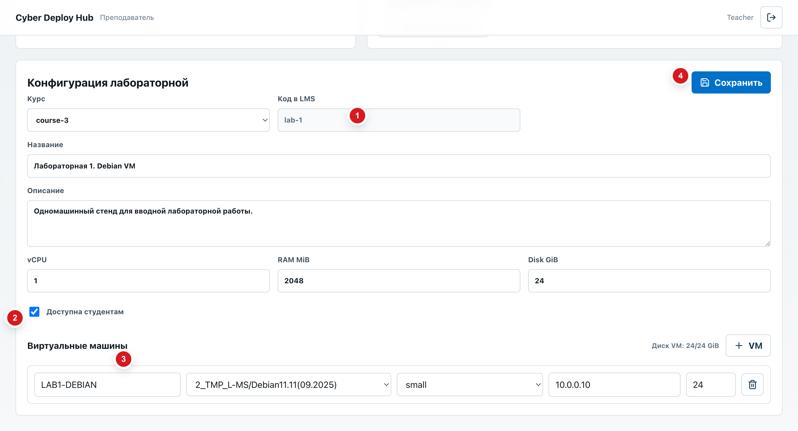
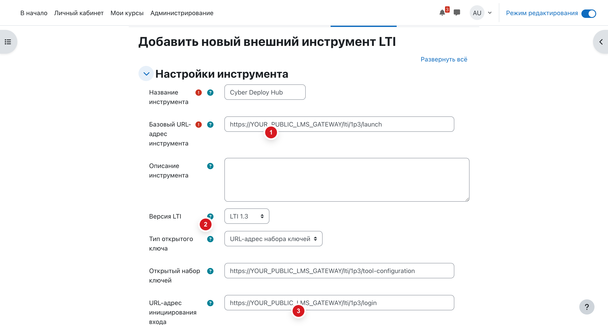
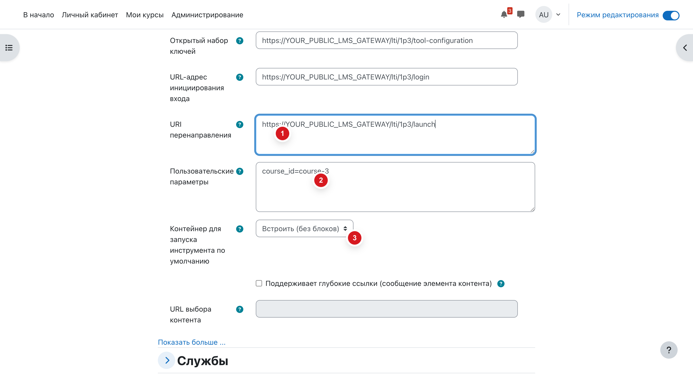
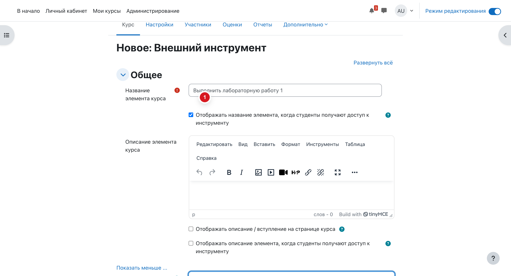
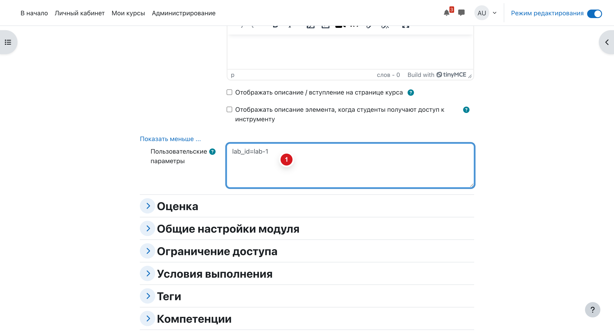
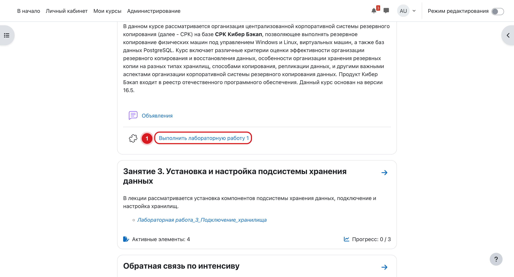

# Настройка лабораторных работ через Moodle

Этот сценарий используется для запуска лабораторных только из Moodle. Студент открывает курс в Moodle, нажимает ссылку лабораторной работы, а Cyber Deploy Hub получает данные запуска через LTI и разворачивает стенд в реальном OpenStack.

Прямой вход студента в Cyber Deploy Hub не используется. Каталог лабораторных работ заполняется преподавателем через веб-интерфейс, без seed/demo данных.

## 1. Что нужно подготовить один раз

Перед настройкой курса проверьте, что Cyber Deploy Hub доступен Moodle по публичному HTTPS-адресу:

```text
https://YOUR_PUBLIC_LMS_GATEWAY
```

Для Moodle используются три адреса:

```text
https://YOUR_PUBLIC_LMS_GATEWAY/lti/1p3/launch
https://YOUR_PUBLIC_LMS_GATEWAY/lti/1p3/login
https://YOUR_PUBLIC_LMS_GATEWAY/lti/1p3/tool-configuration
```

После регистрации инструмента в Moodle администратор стенда переносит значения LTI из Moodle в `.env` Cyber Deploy Hub и перезапускает сервис `lms-gateway-service`:

```text
LTI_PLATFORM_ISSUER=...
LTI_CLIENT_ID=...
LTI_AUTH_LOGIN_URL=...
LTI_JWKS_URL=...
LTI_REDIRECT_URL=https://YOUR_PUBLIC_LMS_GATEWAY/lti/1p3/launch
LTI_DEPLOYMENT_IDS=...
AUTH_FRONTEND_URL=https://YOUR_PUBLIC_CYBER_DEPLOY_HUB
AUTH_COOKIE_SECURE=true
```

Если Moodle находится на другом сервере, нельзя указывать `127.0.0.1` или локальные адреса контейнеров.

## 2. Создать конфигурацию лабораторной в Cyber Deploy Hub

Откройте Cyber Deploy Hub в роли преподавателя и перейдите в пространство преподавателя. Нажмите `Новая`, заполните название, описание и параметры виртуальной машины.



На экране важны четыре места:

1. `Код в LMS` - код, который потом указывается в активности Moodle как `lab_id`.
2. `Доступна студентам` - включите переключатель, иначе запуск из Moodle будет отклонен.
3. Блок VM - выберите образ, flavor, IP и размер диска.
4. `Сохранить` - после сохранения конфигурация становится доступна для запусков.

Преподавателю не нужно придумывать технические идентификаторы вручную. Код в LMS генерируется интерфейсом, его нужно только скопировать в настройку активности Moodle.

## 3. Добавить Cyber Deploy Hub как внешний инструмент курса

В Moodle откройте нужный курс, включите режим редактирования и перейдите в настройки внешних инструментов LTI курса. Создайте новый внешний инструмент.



Заполните основные поля:

| Поле Moodle | Значение |
| --- | --- |
| `Название инструмента` | `Cyber Deploy Hub` |
| `Базовый URL-адрес инструмента` | `https://YOUR_PUBLIC_LMS_GATEWAY/lti/1p3/launch` |
| `Версия LTI` | `LTI 1.3` |
| `Тип открытого ключа` | `URL-адрес набора ключей` |
| `Открытый набор ключей` | `https://YOUR_PUBLIC_LMS_GATEWAY/lti/1p3/tool-configuration` |
| `URL-адрес инициирования входа` | `https://YOUR_PUBLIC_LMS_GATEWAY/lti/1p3/login` |

Ниже в этой же форме заполните параметры запуска.



Укажите:

| Поле Moodle | Значение |
| --- | --- |
| `URI перенаправления` | `https://YOUR_PUBLIC_LMS_GATEWAY/lti/1p3/launch` |
| `Пользовательские параметры` | `course_id=course-3` |
| `Контейнер запуска по умолчанию` | встроенный режим или новое окно, в зависимости от политики курса |

`course_id` связывает курс Moodle с курсом в Cyber Deploy Hub. Для нескольких лабораторных в одном курсе внешний инструмент создается один раз.

## 4. Добавить лабораторную работу в курс Moodle

В нужной секции курса нажмите `Добавить занятие или ресурс` и выберите созданный инструмент `Cyber Deploy Hub`.



В названии активности используйте понятный студенту текст, например:

```text
Выполнить лабораторную работу 1
```

Затем откройте дополнительные настройки активности и укажите код лабораторной.



В поле `Пользовательские параметры` укажите:

```text
lab_id=lab-1
```

`lab_id` должен совпадать с полем `Код в LMS` из конфигурации Cyber Deploy Hub. Для нескольких лабораторных в одном курсе создайте несколько активностей Moodle:

```text
Выполнить лабораторную работу 1 -> lab_id=lab-1
Выполнить лабораторную работу 2 -> lab_id=lab-2
Выполнить лабораторную работу 3 -> lab_id=lab-3
```

## 5. Как запускает студент

Студент заходит в курс Moodle и нажимает ссылку лабораторной работы.



После клика Moodle передает данные пользователя, курса и лабораторной в Cyber Deploy Hub. Сервис закрепляет запуск за Moodle-пользователем, выбирает нужную лабораторную по `lab_id` и показывает студенту состояние стенда.

Студенту не нужно открывать Cyber Deploy Hub отдельно и не нужно вводить отдельные учетные данные.

## 6. Проверка настройки

После настройки проверьте:

- в Cyber Deploy Hub лабораторная сохранена и включен переключатель `Доступна студентам`;
- в Moodle у внешнего инструмента курса указан `course_id`;
- в каждой активности Moodle указан свой `lab_id`;
- публичный адрес `https://YOUR_PUBLIC_LMS_GATEWAY` открывается с сервера Moodle;
- после изменения LTI-параметров в `.env` сервис `lms-gateway-service` перезапущен.

Если студент видит ошибку запуска, сначала проверьте, что `lab_id` существует в Cyber Deploy Hub и лабораторная включена для студентов. Если запуск не доходит до Cyber Deploy Hub, проверьте публичный URL, значения LTI из Moodle и отсутствие локальных адресов вида `localhost` или `127.0.0.1`.
